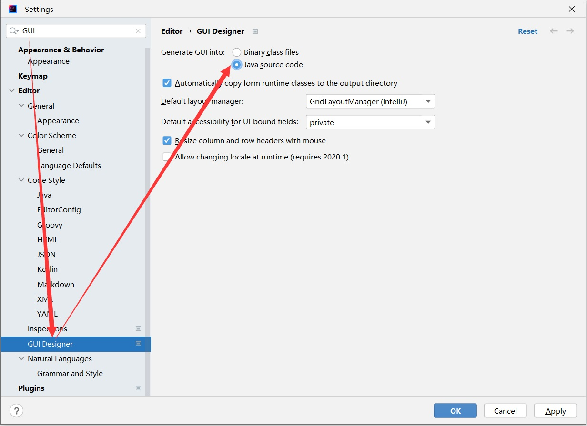

# build-executable-jar

打包为可执行Jar的基础模版。已经添加默认Form，可直接打包后执行。

# 打包前设置

菜单栏 File --> Settings --> Editor --> GUI Designer

如下图所示，设置 Generate GUI into = Java source code

# 打包方法

1. maven clean
2. 菜单栏 Build --> Rebuild Project
3. maven package

注意：一定要按照顺序执行打包

之后生成 build-executable-jar\target\build-executable-jar-1.0-jar-with-dependencies.jar 文件。

直接 java -jar build-executable-jar-1.0-jar-with-dependencies.jar 即可执行该文件。

